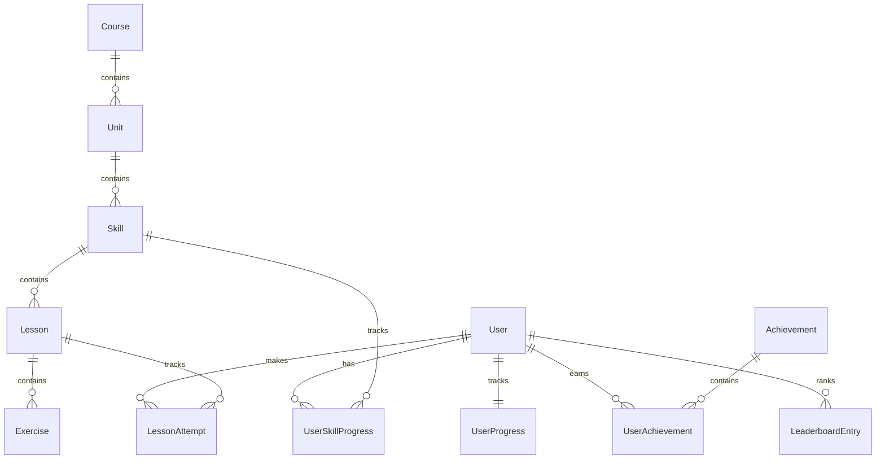

# Duolingo Web App Clone

A full-stack clone of Duolingo's web app that implements the **learning path**, **lesson player**, and **gamification loop** (XP, streak, hearts, gems, leaderboard) alongside multiple courses and full user authentication.

## 🚀 Tech Stack

- **Frontend**: Next.js 16 (App Router), TypeScript, Tailwind CSS, Zustand (state management), Framer Motion (micro-animations), Lucide Icons, canvas-confetti.
- **Backend**: FastAPI (Python 3.13+), Uvicorn, Pydantic v2.
- **Database**: SQLite with SQLAlchemy (async aiosqlite) and Alembic (migrations). Enabled with WAL (Write-Ahead Logging) mode and connection optimizations for production concurrency.
- **Package Managers**: `npm` (frontend) and `uv` (fast Python packages).

---

## 🏛️ Architecture Overview

The app is split into a Next.js client-side application and a FastAPI stateless REST API using SQLite for relational state:

```
[ Next.js Frontend (Port 3000) ]
        │         ▲
        │ Fetch   │ Response (Bearer JWT Token)
        ▼         │
[ FastAPI Backend (Port 8000) ]
        │         ▲
        │ Async   │ SQL Rows
        ▼         │
[ SQLite Database (duolingo.db) ]
```

- **Frontend**: Reusable, modular UI components styling thick 3D buttons (`Button.tsx`) and alternating zigzag paths with SVG dotted lines. Zustand store coordinates optimistic updates for hearts, XP, and gems. Uses Next.js middleware to automatically redirect unauthenticated users to the login screen.
- **Backend**: Serves endpoints, validates JWT credentials, normalizes/checks text inputs for translations, decrements hearts on database write, and triggers unlock cascades.

---

## 🗄️ Database Schema & ER Diagram



---

## 🔌 API Overview

### 1. Authentication
- **`POST /api/auth/register`** -> Create user account, setup default starter stats, and issue session JWT token.
- **`POST /api/auth/login`** -> Verify password hash and return JWT session token.

### 2. Languages / Courses
- **`GET /api/courses`** -> Fetch available language courses (Spanish, French, German).
- **`POST /api/courses/select`** -> Choose active language course and initialize starter skill progresses for it.

### 3. Learning Path
- **`GET /api/path`** -> Returns current active course unit tree, mapping lock/unlock states dynamically based on prerequisites.

### 4. User Stats & Progress
- **`GET /api/progress`** -> Fetch current user progress metrics.
- **`POST /api/progress/hearts/refill`** -> Refill hearts to 5 (costs 100 gems).

### 5. Lesson Player
- **`GET /api/skills/{skill_id}/lesson`** -> Generates and returns a lesson containing a list of exercises. Omit `correct_answer` to prevent client-side cheat leaks.
- **`POST /api/exercises/{id}/answer`** -> Submits user answer. Normalizes inputs server-side. Decrements hearts if wrong. Returns correct answer if failed.
- **`POST /api/lessons/{id}/complete`** -> Saves lesson score, increments crowns, streak, and checks/saves earned achievements.

### 6. Leaderboard & Profile
- **`GET /api/leaderboard`** -> Leaderboard standings.
- **`GET /api/profile`** -> Fetch stats summary and grid of earned achievement badges.

---

## 🛠️ Setup Instructions

Ensure you have **Python 3.11+** and **Node.js 18+** installed.

### 1. Backend Setup
```bash
# Navigate to backend
cd backend

# Create virtual environment and install dependencies
python3 -m venv .venv
source .venv/bin/activate
pip install -r requirements.txt
pip install greenlet

# Apply database migrations
alembic upgrade head

# Seed the database
python -m app.seed

# Start the development server
uvicorn app.main:app --host 127.0.0.1 --port 8000 --reload
```

### 2. Frontend Setup
```bash
# Navigate to frontend
cd frontend

# Install packages
npm install

# Start the dev server
npm run dev -- --port 3000
```
Open [http://localhost:3000](http://localhost:3000) to see the app.

### 3. Running Automated Tests
```bash
# Navigate to backend
cd backend
PYTHONPATH=. .venv/bin/pytest
```

---

## 🌐 Production Deployment

- **Backend (Render)**: [https://duolingo-clone-k15v.onrender.com](https://duolingo-clone-k15v.onrender.com)
- **Frontend (Vercel)**: Connects to the backend via `NEXT_PUBLIC_API_URL`.
