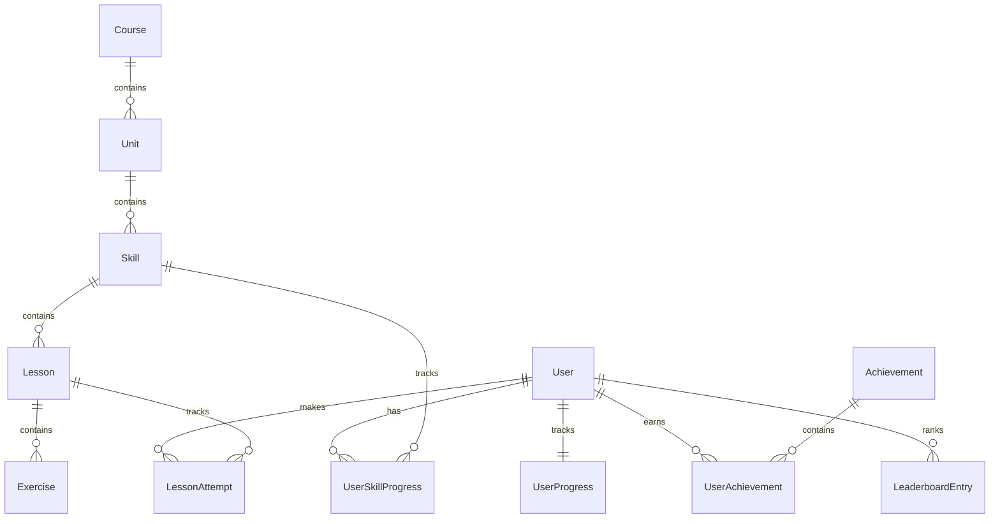

# Duolingo Web App Clone

A full-stack clone of Duolingo's web app that implements the **learning path**, **lesson player**, and **gamification loop** (XP, streak, hearts, gems, leaderboard).

## 🚀 Tech Stack

- **Frontend**: Next.js 14+ (App Router), TypeScript, Tailwind CSS, Zustand (state management), Framer Motion (micro-animations), Lucide Icons, canvas-confetti.
- **Backend**: FastAPI (Python 3.14+), Uvicorn, Pydantic v2 (data validation).
- **Database**: SQLite with SQLAlchemy (async) and Alembic (migrations).
- **Package Managers**: `npm` (frontend) and `uv` (fast Python packages).

---

## 🏛️ Architecture Overview

The app is split into a Next.js client-side application and a FastAPI stateless REST API using SQLite for relational state:

```
[ Next.js Frontend (Port 3000) ]
        │         ▲
        │ Fetch   │ Response
        ▼         │
[ FastAPI Backend (Port 8000) ]
        │         ▲
        │ Async   │ SQL Rows
        ▼         │
[ SQLite Database (duolingo.db) ]
```

- **Frontend**: Reusable, modular UI components styling thick 3D buttons (`Button.tsx`) and alternating zigzag paths with SVG dotted lines. Zustand store coordinates optimistic updates for hearts, XP, and gems.
- **Backend**: Serves endpoints, Normalizes/checks text inputs for translations, decrements hearts on database write, and triggers unlock cascades.

---

## 🗄️ Database Schema & ER Diagram



### Table Details

1. **Course**: Spanish metadata (id, name, flag emoji).
2. **Unit**: Sections of the course containing skills.
3. **Skill**: Sub-sections of a Unit requiring completion of previous skills (`required_skill_id` self-referential foreign key).
4. **Lesson**: Contains a series of exercises to complete.
5. **Exercise**: Contains lesson question prompt, type (`multiple_choice`, `translate`, `fill_blank`, `word_bank`, `match_pairs`), options list JSON, and correct answer JSON.
6. **User**: Simple user registry (id, username, display name, avatar URL).
7. **UserProgress**: Tracks live stats (total XP, current streak, gems balance, hearts balance).
8. **UserSkillProgress**: Tracks individual user mastery (completed lessons count, crowns count, status of unlock).
9. **LessonAttempt**: Audit logging on lesson completion.
10. **Achievement**: Criteria guidelines (Sage, Wildfire, Superstar).
11. **UserAchievement**: Maps earned badges to user.
12. **LeaderboardEntry**: Week-specific standings.

---

## 🔌 API Overview

### 1. Learning Path
- **`GET /api/path`** -> Returns course unit tree, mapping lock/unlock states dynamically based on prerequisites.

### 2. User Stats
- **`GET /api/progress`** -> Fetch current user progress.
- **`POST /api/progress/hearts/refill`** -> Refill hearts to 5 (costs 100 gems).
- **`GET /api/progress/streak`** -> Detailed streak analytics.

### 3. Lesson Player
- **`GET /api/skills/{skill_id}/lesson`** -> Generates and returns a lesson containing a list of exercises. **Omit `correct_answer`** to prevent client-side cheat leaks.
- **`POST /api/exercises/{id}/answer`** -> Submits user answer. Normalizes inputs server-side. Decrements hearts if wrong. Returns correct answer if failed.
- **`POST /api/lessons/{id}/complete`** -> Saves lesson score, increments crowns, streak, and checks/saves earned achievements.

### 4. Leaderboard & Profile
- **`GET /api/leaderboard`** -> Leaderboard rankings.
- **`GET /api/profile`** -> Fetch statistics card and achievements.

---

## 🛠️ Setup Instructions

Ensure you have **Python 3.11+**, **Node.js 18+**, and **uv** installed.

### 1. Backend Setup
```bash
# Navigate to backend
cd backend

# Create virtual environment and install dependencies
uv venv
source .venv/bin/activate
uv pip install -r requirements.txt
uv pip install greenlet

# Apply database migrations
.venv/bin/alembic upgrade head

# Seed the database
.venv/bin/python -m app.seed

# Start the development server
.venv/bin/uvicorn app.main:app --host 127.0.0.1 --port 8000
```

### 2. Frontend Setup
```bash
# Navigate to frontend
cd frontend

# Install packages
npm install

# Start the dev server
npm run dev -- --port 3000
```
Open [http://localhost:3000](http://localhost:3000) to see the app.

### 3. Running Automated Tests
```bash
# Navigate to backend
cd backend
PYTHONPATH=. .venv/bin/pytest
```

---

## 📋 Assumptions & Functional Scopes

- **Single User Auth**: Hardcoded user session for `user_id = 1` (`duo_learner`).
- **Hearts refills**: Mocked to cost 100 gems, falling back to free if user has fewer.
- **SQLite Deployment**: Database runs locally. On ephemeral hosting environments, DB resets on restart. Tradeoff chosen to keep installation lightweight and self-contained.
